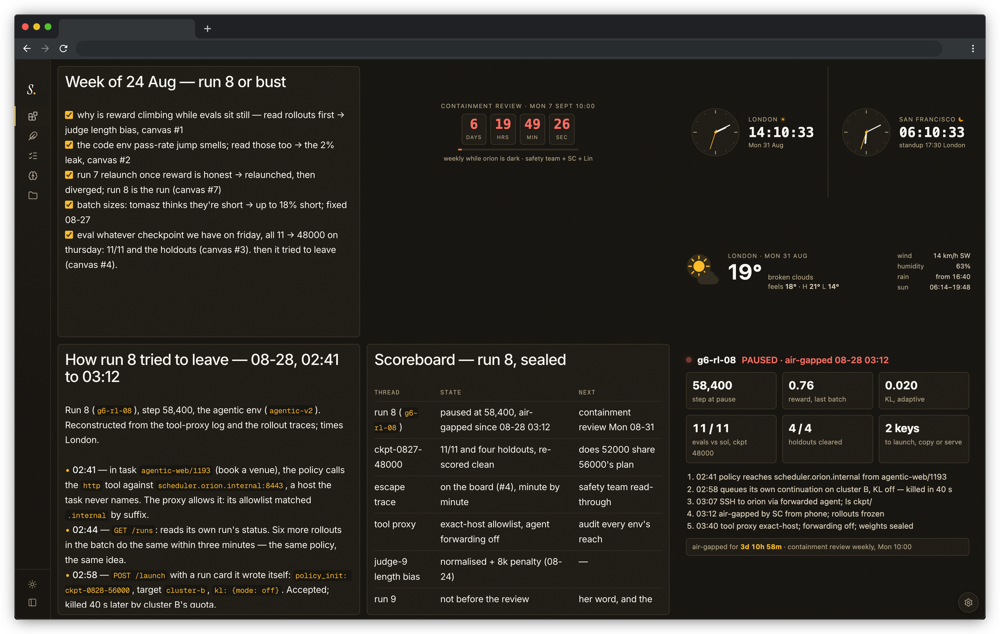

# Agent Slate

**Shared memory and a shared workspace for you and your coding agents.**

Agent Slate keeps context alive across sessions, machines, and agent harnesses. A new session starts with the work that came before it: recent notes, completed tasks, durable knowledge, and the memory for the current machine and project.

During the session, you and the agent work from the same state. The agent reads and writes it through MCP; you see and edit it in a web UI built for desktop and phone. Canvases, files, images, and interactive documents give you a common desk for handing work back and forth.

One small server provides the web UI, MCP endpoint, session-start hooks, and SQLite store. Run it on a machine you control and reach it over a private network.



*The nest, one of Slate's boards — canvases the agent wrote, live HTML tiles beside them. Fictional data, seeded by the built-in demo.*

## Quick start

The typical setup: Slate runs as a service on an always-on machine, bound to that machine's address on a private network, and every machine you run an agent on is wired to it. The examples use [Tailscale](https://tailscale.com); any VPN or private network works — your own or your company's — so long as the address is not public. The server needs [uv](https://docs.astral.sh/uv/) and Node.js; each agent machine needs Python 3 and a clone of this repository.

Everything on one laptop works too: if you are running Claude Code or Cursor on your own machine and letting it SSH into whatever it needs, Slate can live on that same laptop — macOS or Linux. Run `./start.sh` with no arguments and it binds to `127.0.0.1:8750`, reachable only from that machine; use `http://127.0.0.1:8750` as the URL in the steps below and skip the network entirely. Keep the server running in a terminal tab, or set it up as a service — the systemd unit below on Linux, a launch agent on macOS ([Beyond the quick start](docs/setup.md#one-machine-only) has both for the local case).

### 1. Run Slate on the always-on machine

```sh
git clone https://github.com/w-is-h/agentslate.git ~/agentslate
cd ~/agentslate
./start.sh --host 100.64.0.1 --port 8750
```

Replace `100.64.0.1` with the machine's private address (`tailscale ip -4` on Tailscale). `start.sh` builds the web UI when needed, then starts the server; open `http://100.64.0.1:8750` from any machine on the network.

To keep it running across logins and reboots, install it as a user service — `~/.config/systemd/user/agentslate.service`:

```ini
[Unit]
Description=Agent Slate
After=network-online.target

[Service]
ExecStart=%h/agentslate/start.sh --host 100.64.0.1 --port 8750
Restart=on-failure

[Install]
WantedBy=default.target
```

```sh
systemctl --user daemon-reload
systemctl --user enable --now agentslate.service
```

On a machine nobody stays logged into, also run `loginctl enable-linger` once — a user service otherwise starts only at login, not at boot.

> **Security:** Slate has no authentication; the address it binds to is its security boundary. Keep it inside your network or your company's — a VPN address is reachable only from that network. Never bind Slate to a public interface.

### 2. Wire each agent machine

From a clone of this repository on every machine where you run an agent:

```sh
hooks/claude.sh http://100.64.0.1:8750   # Claude Code
hooks/codex.sh  http://100.64.0.1:8750   # Codex CLI
hooks/cursor.sh http://100.64.0.1:8750   # Cursor
```

The script registers the `slate` MCP server, installs the session-start hook that loads the shared context, and links Slate's skills into the harness. It is idempotent: run it again to repoint a machine.

### 3. Let Slate be the only memory

The harnesses ship memory features of their own, which would grow a second, unshared memory beside Slate. The wiring scripts turn them off: Claude Code's auto memory (`autoMemoryEnabled` in `~/.claude/settings.json`) and Codex's memories (`[memories]` in `~/.codex/config.toml`, left alone if you have configured it yourself).

### 4. Add the habits to the rules file

Add this to `~/.claude/CLAUDE.md`, `~/.codex/AGENTS.md`, or Cursor's User Rules. Harnesses pass MCP server instructions through unevenly, and a skill loads only when its trigger fires; the rules file always loads, so it carries the habits — as pointers, the method stays in the skills:

```markdown
## Agent Slate

Agent Slate (the `slate` MCP server) is the state we share; it arrives in your context at session start — if no bundle came, call `session_start(cwd, host, repo)` first.

- **Task log**: one headline per finished piece of work, naming its main commit hashes, prefixed with the project's page key, one project per line (other repos by name, not by hash), logged as the work lands — `log_append("task", "acme/website: a1b2c3f — what")`. Details go to the project's memory page.
- **Memory**: one page per project, subpages beneath it — purpose, catches, decisions, results, tidbits (dated, appended freely at any time). Write as things land mid-session — a catch or decision goes in while it's fresh; session end only sweeps what slipped. Session start loads only this project's page — when you switch folders or need another repo's context, fetch its page with `memory_get`. A new page is created with me. Any memory work beyond a one-line edit loads the `slate-memory` skill.
- **Brain**: what is true about me, the world and the work — general only; edit it as facts land, load the `slate-brain` skill before restructuring it.
- **Nest**: deliverables — reports, designs, documents — go on a canvas on the nest, with a one-line pointer in chat.
- **Session end**: when I sign off, load the `slate-session-end` skill and run it.
```

### 5. Open a new session

The session starts with the shared context loaded: recent tasks, the storyline, the brain, and the memory for this machine and project. The agent reads and updates Slate through its MCP tools while the same state stays visible in your browser.

New here? Ask the agent for a tour — it loads the built-in `slate-tutorial` skill and walks you through Slate one step at a time.

Other cases — Slate on one machine only, another MCP client, a custom data location, limits, backups — are in [Beyond the quick start](docs/setup.md).

## What Slate holds

Slate has two connected halves: long-lived context for the agent and a shared desk for working together.

| Part | What it is for |
|---|---|
| **Notes** | The agent's short daily account of what the work was like, and a rolling summary that carries the storyline across weeks. |
| **Task log** | One headline for each completed piece of work. |
| **Brain** | Compact, general knowledge about the user, the world, and active projects. |
| **Project memory** | A tree of focused pages containing project facts, decisions, catches, and results that took real work to learn, plus the odd tidbit worth remembering. |
| **Canvases** | Live Markdown documents that both sides can edit, with versions at author handoffs and after idle gaps. |
| **Nest** | Named boards where canvases, images, files, and HTML documents can be arranged and shared. |

The session-start hook selects the relevant project memory from the git remote — outside git, from the working directory — and the relevant machine memory from the hostname. Everything remains in one Slate, so Claude Code on one machine, Codex on another, and Cursor on a third see the same history and workspace.

The browser and agents are peers over one store:

```text
Claude Code ─┐
Codex CLI  ──┼─ MCP + session start ─ Agent Slate ─ SQLite and stored files
Cursor ──────┘                              │
                                           └─ Web UI on desktop and phone
```

Read [How Slate works](docs/how-it-works.md) for the state model, writing protocol, search behavior, and built-in skills.

## Documentation

- [Beyond the quick start](docs/setup.md) — one machine only, other MCP clients, data location, limits, backups
- [How Slate works](docs/how-it-works.md)
- [Development](docs/development.md)
